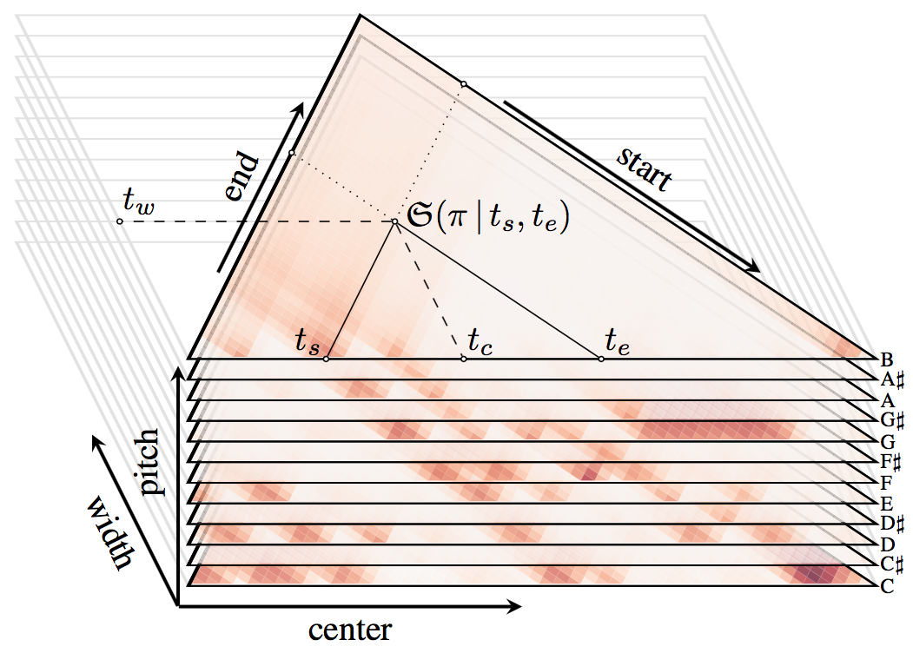
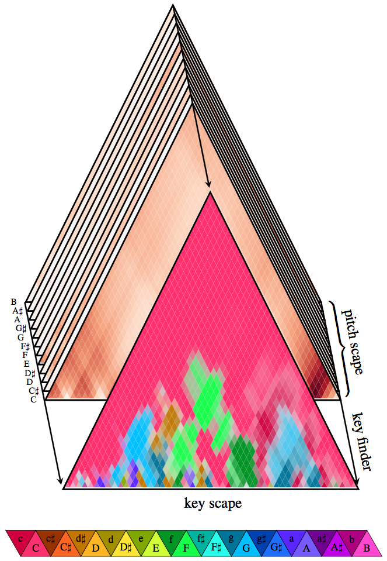

# Pitch Scapes
Python library to compute pitch scapes for music analysis.



The implemented methods are described in (please cite when using this library for publications):

Lieck R, Rohrmeier M (2020) **Modelling Hierarchical Key Structure with Pitch Scapes**. In: *Proceedings of the 21st International Society for Music Information Retrieval Conference*. Montréal, Canada
```
@inproceedings{lieckModellingHierarchicalKey2020,
  title = {Modelling Hierarchical Key Structure with Pitch Scapes},
  booktitle = {Proceedings of the 21st International Society for Music Information Retrieval Conference},
  author = {Lieck, Robert and Rohrmeier, Martin},
  year = {2020},
  location = {{Montréal, Canada}},
  eventtitle = {21st International Society for Music Information Retrieval Conference}
}
```

**Note:** I will progressively refactor my existing code and make it available as a clean library here. Please contact me if you have any questions or are missing anything!
